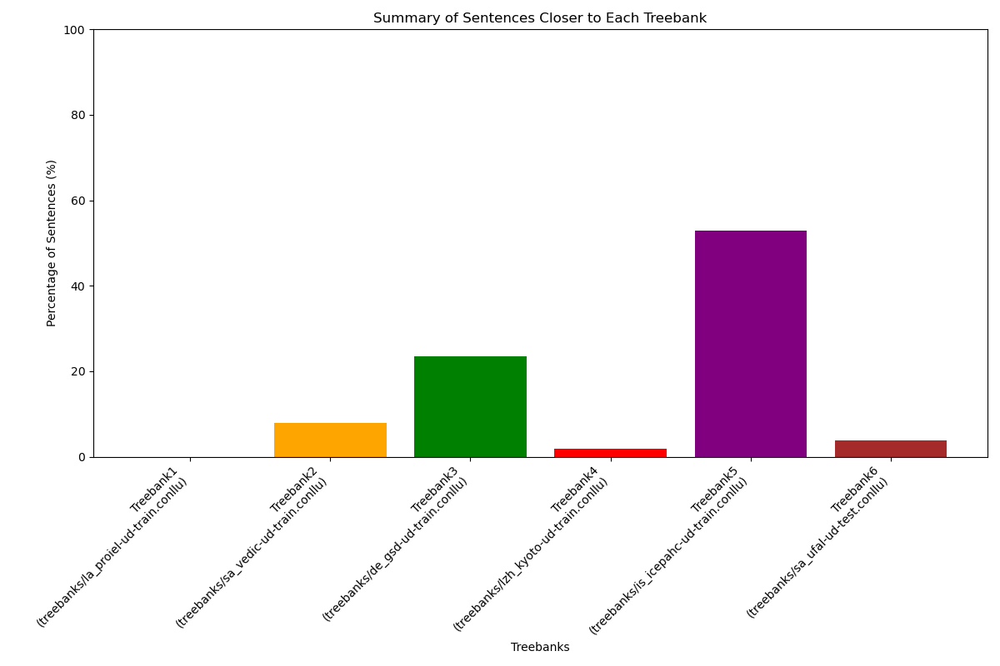

# Dependency Tree Structural Comparison Tool

Some people claim to have deciphered the IVC script. In order to see if their proposed Sanskrit "translations" make any sense, this code does the following:

1. In preperation, I part-of-speech tagged and dependency parsed the corpus with the 2024 grammatical analyzer: [byt5-sanskrit-analyzers](https://github.com/sebastian-nehrdich/byt5-sanskrit-analyzers)
2. Then this code compares the structure of the trees via tree edit distance against existing reference corpora, averages out the results, and plot them. Results show that IVC sentence structure, disregarding for lemmas, is most similar to historical Icelandic documents.

Here are the results:



## Overview

This tool compares dependency tree structures between an input corpus and multiple reference treebanks to determine structural similarities across languages. The comparison is based on a tree edit distance metric that considers differences in parent-child relationships and overall tree structure.

## Purpose

The primary purpose of this tool is to analyze structural similarities between languages by comparing dependency trees. This can be useful for:

1. Typological language comparison
2. Historical linguistics research
3. Determining similarities between an unknown language and known language families
4. Evaluating parsing models across languages

## How It Works

### Data Processing

1. **Input Parsing**: 
   - Parses a custom format with words and their heads (e.g., `word-headID`)
   - Converts each sentence into a list of `DependencyNode` objects

2. **Treebank Parsing**:
   - Parses Universal Dependencies (UD) format treebanks
   - Creates comparable dependency tree structures

3. **Length Normalization**:
   - Filters treebank sentences to only include those with length less than or equal to the maximum length in the input corpus
   - This ensures fair comparisons between sentences of similar complexity

### Distance Calculation

The tool calculates a tree edit distance between dependency structures based on two factors:

1. **Insertion/Deletion Cost**: The number of nodes that exist in one tree but not the other
2. **Relationship Cost**: The number of common nodes with different head assignments

The final distance is normalized by the size of the larger tree to produce a value between 0 and 1.

### Analysis

For each input sentence, the tool:

1. Computes the edit distance against every sentence in each reference treebank
2. Calculates the average distance to each treebank
3. Determines which treebank the sentence is structurally closest to

## Output

The tool generates:

1. **Detailed Results File** (`tree_distances.txt`):
   - For each input sentence, shows the average distance to each treebank
   - Indicates which treebank the sentence is closest to

2. **Summary Statistics**:
   - Percentage of input sentences closest to each treebank
   - Count of sentences that are equally close to multiple treebanks

3. **Visualization**:
   - Bar chart showing the distribution of sentences across treebanks

## Treebanks Used

The tool currently compares against six reference treebanks:

1. Latin PROIEL (`la_proiel-ud-train.conllu`)
2. Sanskrit Vedic (`sa_vedic-ud-train.conllu`)
3. German GSD (`de_gsd-ud-train.conllu`)
4. Classical Chinese Kyoto (`lzh_kyoto-ud-train.conllu`)
5. Icelandic IcePaHC (`is_icepahc-ud-train.conllu`)
6. Sanskrit UFAL (`sa_ufal-ud-test.conllu`)

## Usage

```bash
python dependency_comparison.py --output results_filename.txt
```

## Limitations

1. The tree edit distance metric is simplified and doesn't account for specific linguistic phenomena.
2. The approach compares each input sentence against all treebank sentences rather than finding semantically similar sentences, which is of course problematic. But given the fact that the IVC "translations" aren't semantically coherent anyway, we can't do better than this.
3. Structural similarity of course doesn't necessarily indicate genetic relationship between languages.

## Requirements

- Python 3.6+
- NumPy
- Matplotlib

