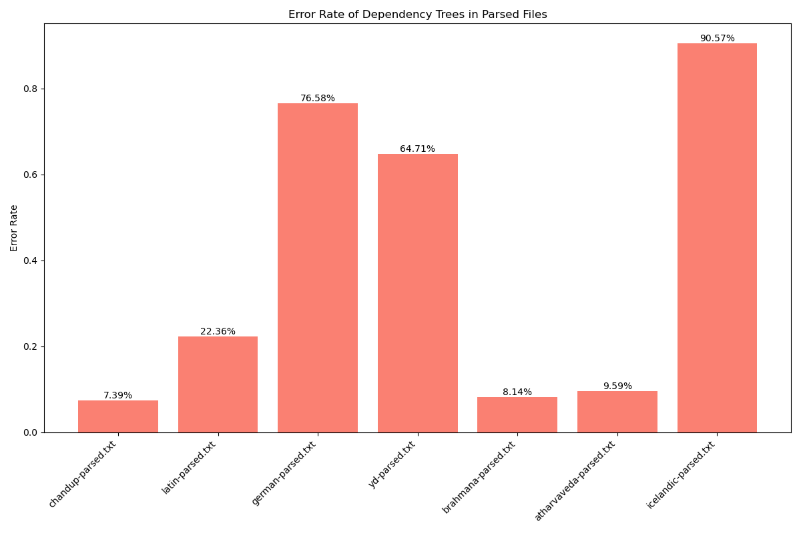

# IVC "Decipherments" vs. (Vedic) Sanskrit Grammatical Parsing 
Simple experiment: Parse verious sections of the Vedic/Sanskrit corpus with a proper dependency parser, parse YD's IVC "Decipherments" with the same parser, parse random unrelated languages with the same parser. Plot error rate. Here we go: 

YD's reconstructions produce as valid Sansk
# Dependency Tree Structural Comparison Tool

Some people claim to have deciphered the IVC script. In order to see if their proposed Sanskrit "translations" make any sense, this code does the following:

1. In preperation, I part-of-speech tagged and dependency parsed the corpus with the 2024 grammatical analyzer: [byt5-sanskrit-analyzers](https://github.com/sebastian-nehrdich/byt5-sanskrit-analyzers)
2. Then this code compares the structure of the trees via tree edit distance against existing reference corpora, averages out the results, and plot them. Results show that IVC sentence structure, disregarding for labels, is most similar to historical Icelandic documents.

Here are the results:

